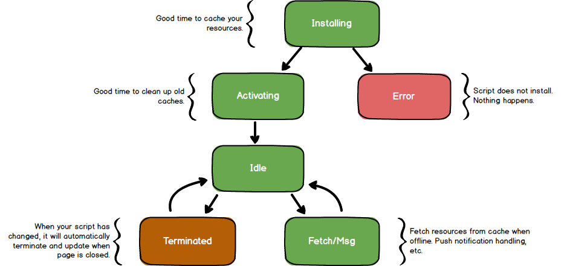

#Service worker

Service worker is an event driven script that runs independently of your website. It is a javascript file that runs in the backgorund and can be used to modify request, sync resources in the background and provide offline experience and push notification. Due to its ability to modify network request, it must be served over a secure connection via HTTPS or run on localhost, reducing the chance of a MITM attacks.

## Lifecycle

## Events

### Installing
